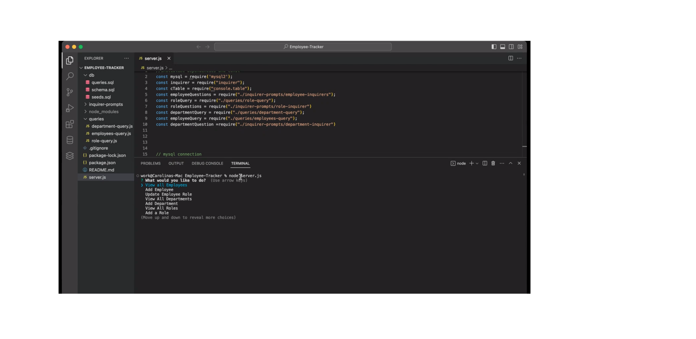

# Employee-Tracker

## Description
This app was created to help you  view and manage the departments, roles and employees in your company. One place to better organize and plan your business. 

## Table of Contents 

- [Installation](#installation)
- [Usage](#usage)
- [Credits](#credits)
- [License](#license)
- [Questions](#questions)

## Installation 

For you to use this app, you will have to run the npm init command on your terminal and install the dependencies mysql2 and inquirer 8.2.4 version. Once you install all of this you will be able to run the command node server.js to start viewing and updating your information. 

## Usage

Once you have install all the dependencies to run this app, you will be able to select from a menu more than one time until your done entering, viewing or updating your company's information. 

## Credits

I've used all the material provided in class and research more information on www.sqlshack.com, stackoverflow.com

## License
None.

## Links

GitHub repo:https://github.com/caroHagg/Employee-Tracker

